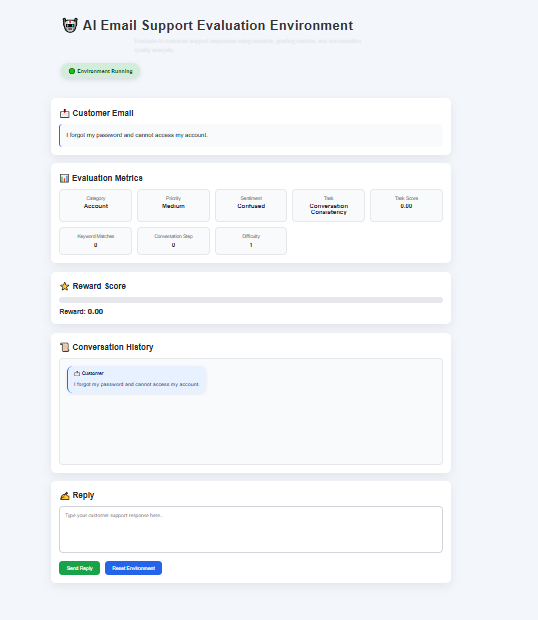
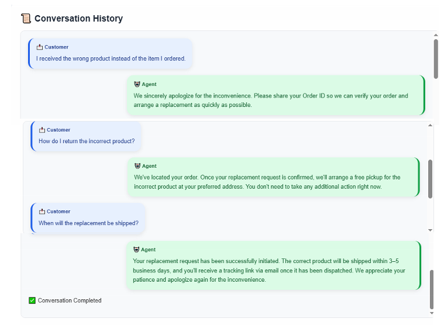
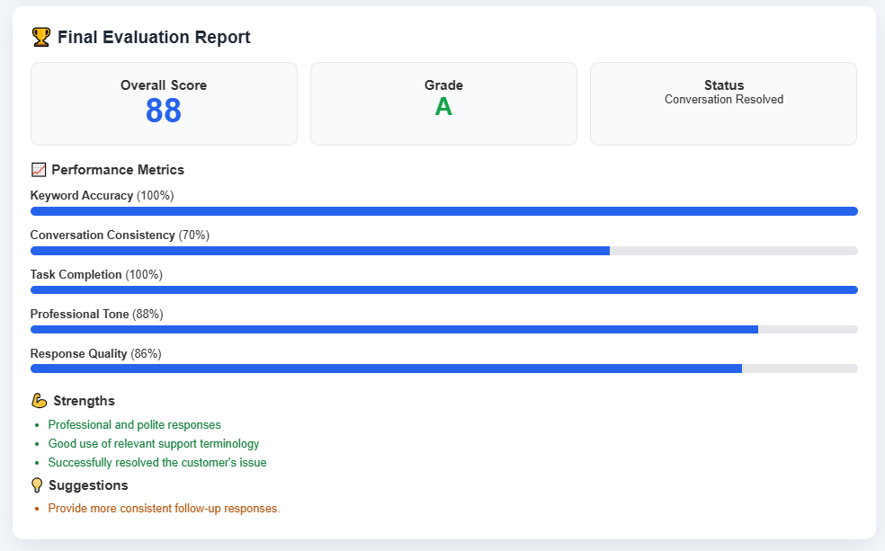

# 🤖 AI Email Support Evaluation Environment

> **A Reinforcement Learning (RL)-inspired environment for evaluating AI-powered customer support agents through realistic multi-turn email conversations.**

[](https://email-support-rl-env.onrender.com)


---

# 📖 Overview

The **AI Email Support Evaluation Environment** simulates real-world customer support email conversations where an AI agent interacts with customers over multiple turns.

Each response is automatically evaluated using a reward-based scoring system inspired by Reinforcement Learning (RL), measuring:

- 🎯 Response Relevance
- 🔑 Keyword Matching
- 💬 Professional Tone
- ✅ Issue Resolution
- 🔄 Conversation Consistency

This environment provides an interactive platform for benchmarking customer support AI agents and experimenting with intelligent evaluation workflows.

---

## 🌐 Live Demo

**Render:** https://email-support-rl-env.onrender.com

---

# ✨ Features

- 📧 Multi-turn customer support conversations
- 🤖 RL-inspired reward evaluation
- 📊 Interactive evaluation dashboard
- 🎯 Task-specific grading
- 📈 Performance metrics
- 📨 Multiple customer support scenarios
- ⚡ FastAPI backend
- 🌐 Interactive HTML/CSS/JavaScript frontend
- 🧪 Automated testing using Pytest
- 🐳 Docker support
- 🤗 Hugging Face deployment ready

---

# 📸 Screenshots

## 🖥 AI Email Support Dashboard

<p align="center">
  
</p>

---

## 💬 Multi-turn Conversation

<p align="center">
  
</p>

---

## 🏆 Final Evaluation Report


<p align="center">
  
</p>

---

# 🏗 Architecture

```text
                Customer Email
                      │
                      ▼
            AI Support Agent
                      │
                      ▼
          Response Generation
                      │
                      ▼
        Reward & Keyword Evaluation
                      │
                      ▼
             Task-specific Graders
                      │
                      ▼
         Updated Conversation State
                      │
                      ▼
          Final Evaluation Report
```

---

# 📂 Project Structure

```text
email-support-rl-env/
│
├── env/
│   ├── env.py
│   ├── evaluation.py
│   ├── rewards.py
│   ├── graders.py
│   ├── scenarios.py
│   ├── tasks.py
│   └── models.py
│
├── server/
│   ├── app.py
│   └── __init__.py
│
├── UI/
│   ├── index.html
│   ├── style.css
│   └── script.js
│
├── tests/
│   ├── test_rewards.py
│   └── test_graders.py
│
├── screenshots/
│
├── Dockerfile
├── requirements.txt
├── inference.py
└── README.md
```

---

# 📧 Supported Customer Scenarios

The environment currently supports:

- Refund Request
- Delayed Delivery
- Wrong Product Received
- Duplicate Payment
- Payment Deducted but Order Failed
- Password Reset
- Account Locked
- Order Cancellation
- Refund Status Inquiry
- Address Change Request

---

# 🎯 Evaluation Tasks

The AI agent is evaluated across three major dimensions.

| Task | Description |
|------|-------------|
| **Basic Response Quality** | Measures keyword relevance, politeness, and clarity |
| **Conversation Consistency** | Evaluates context retention and coherent follow-up responses |
| **Issue Resolution Quality** | Measures issue resolution effectiveness and customer satisfaction |

---

# 🏆 Reward Function

Rewards are calculated using multiple evaluation signals.

| Component | Reward |
|-----------|--------|
| Keyword Match | +1.0 |
| Multiple Keywords | +1.5 |
| Professional Tone | +0.5 |
| Resolution Bonus | +1.0 |
| Repetition Penalty | -0.5 |
| Short Reply Penalty | -0.5 |

Normalized Reward Range

```text
0.01 → 0.99
```

---

# 📊 Evaluation Dashboard

After completing the conversation, the environment generates a detailed evaluation report containing:

- ✅ Overall Score
- 🎓 Grade
- 📌 Resolution Status
- 📈 Keyword Accuracy
- 🔄 Conversation Consistency
- ✔ Task Completion
- 💬 Professional Tone
- ⭐ Response Quality
- 💪 Strengths
- 💡 Suggestions

---

# 🚀 Quick Start


## Clone the Repository

```bash
git clone https://github.com/KeerthyHQ/email-support-rl-env.git
cd email-support-rl-env
```

## Create a Virtual Environment

### Linux / macOS

```bash
python3 -m venv .venv
source .venv/bin/activate
```

### Windows

```powershell
python -m venv .venv
.venv\Scripts\activate
```

---

## Install Dependencies

```bash
pip install -r requirements.txt
```

---

# ▶ Run the Application

Start the FastAPI server:

```bash
uvicorn server.app:app --reload
```

Open your browser and navigate to:

```
http://127.0.0.1:8000
```

---

# 🤖 Run the Inference Agent

```bash
python inference.py
```

---

# 🧪 Run Tests

```bash
pytest
```

Expected Output:

```text
2 passed
```

---

# 🐳 Docker

## Build the Docker Image

```bash
docker build -t email-support-env .
```

## Run the Container

```bash
docker run -p 7860:7860 email-support-env
```

---

# 🤗 Deploy to Hugging Face Spaces

1. Create a **Docker Space** on Hugging Face.
2. Clone the Space repository.

```bash
git clone https://huggingface.co/spaces/<username>/email-support-rl-env
```

3. Copy the project files into the Space.
4. Commit and push.

```bash
git add .
git commit -m "Deploy project"
git push
```

---

# 💬 Example Conversation

### Customer

> I received the wrong product instead of the item I ordered.

### Agent

> We sincerely apologize for the inconvenience. Please share your Order ID so we can verify the issue and arrange a replacement as quickly as possible.

Reward

```text
0.84
```

Task Score

```text
0.91
```

---

# 🔮 Future Enhancements

- Sentiment-aware rewards
- Dynamic customer personas
- LLM-as-a-Judge evaluation
- Human feedback integration
- Analytics dashboard
- Multi-agent evaluation
- RL fine-tuning support

---

# 🛠 Tech Stack

- Python
- FastAPI
- Pydantic
- HTML
- CSS
- JavaScript
- Docker
- Pytest

---

# 👩‍💻 Author

**Keerthika M**

GitHub: https://github.com/KeerthyHQ

---

# 📄 License

This project is licensed under the **MIT License**.